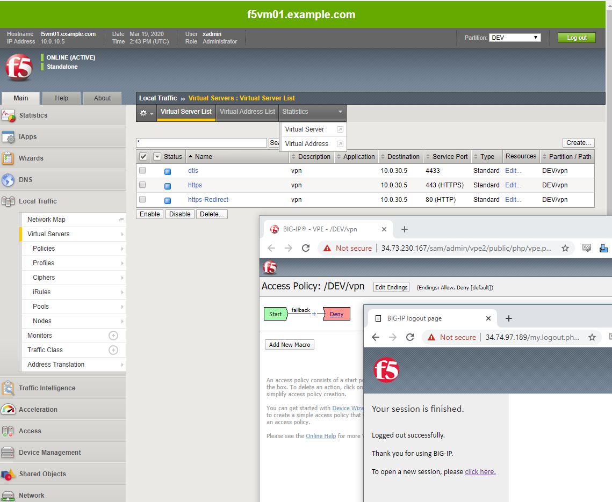
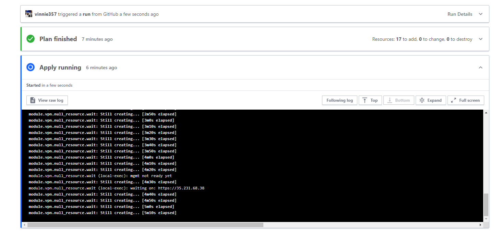

# deploy f5 SSL VPN in GCP on demand

# terraform cloud
terraform cloud account
# create project in terraform cloud

# fork this repo for your edits and builds.
link terraform cloud to the repo for githooks

# create gcp service account and key for terraform cloud
login to gcp and issue a service account with permissions to your project

# set project variables for terraform cloud project
! mark items as sensitive for write only access
- serviceAccountFile
    - your json service account [ sensitive]
- gcpProjectId
    - the project ID you want to deploy in
- gcpRegion
    - example : us-east1
- gcpZone
    - example: us-east1-b
- projectPrefix
    - mydeployment-
- adminSrcAddr
    - ip/mask in cidr formatt for admin access
- adminAccount
    - admin account name ( not admin)
- adminPass [ sensitive]
    - your temp password
- InstanceCount
    - 1 for this demo
- gceSshPubKeyFile [ sensitive]
    - contents of the admin ssh public key file 
#
# queue a run of the project
